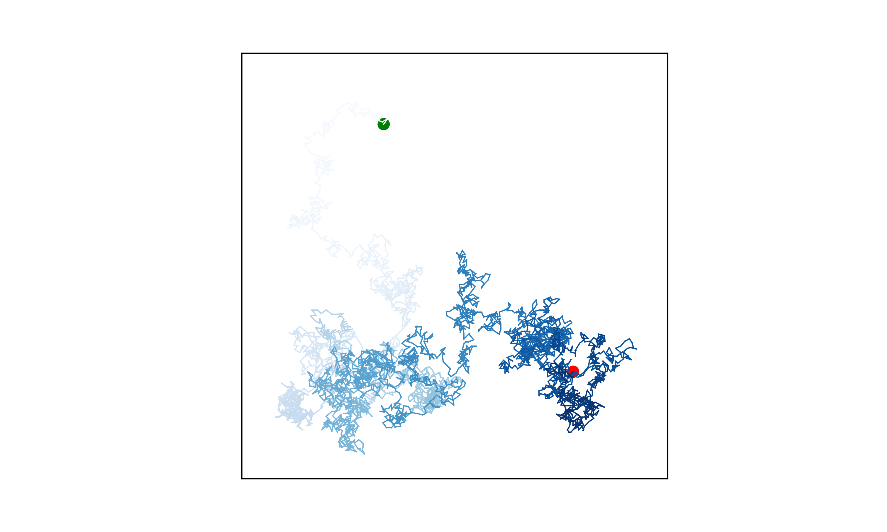

# Random Walk Visualizer

This Python project generates and visualizes **random walks** using Matplotlib. The program simulates  simulate the path of a pollen grain on the surface of a drop of water with a gradient color effect.

## Features
- Generates **5000 random steps** (default) in 2D.
- Uses Matplotlib to plot smooth, color-gradient paths.
- Highlights the **start point (green)** and **end point (red)**.
- Allows continuous generation of new random walks.

## Installation
1. Clone the repository:
https://github.com/pablo727/random-walk-matplotlib
2. Install dependencies:
pip install matplotlib
3. Run the script:
python molecular_motion.py

## Example Output
 *(You can add a screenshot of the plot)*

## License
This project is open-source. Feel free to modify and experiment!

